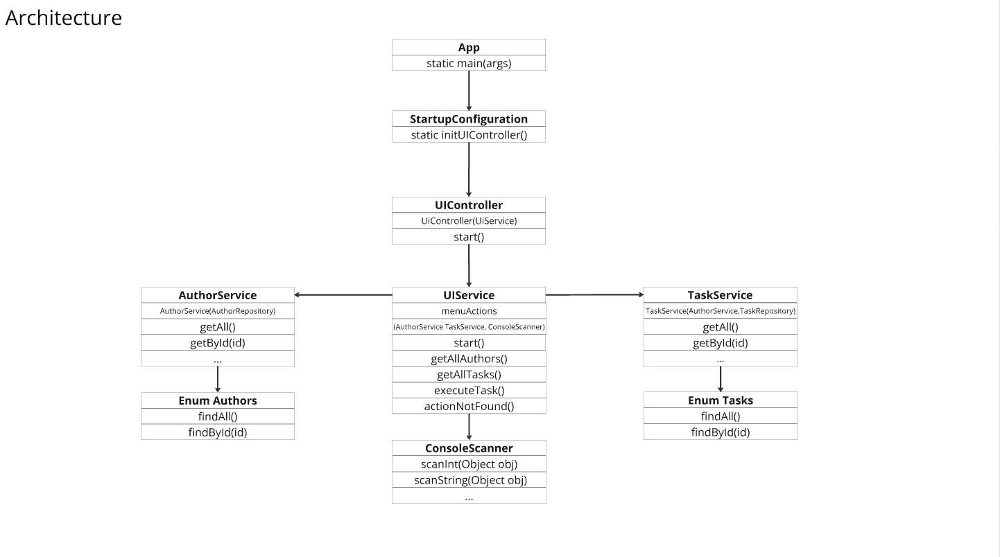

# codewars1225

## Description
This project is a console application written in Java that allows running specific tasks collected from the Codewars platform. The application provides an interface for selecting a task author and executing their method to perform a specific task.

## Architecture

### Enums

- **Enum `Authors`:** Contains a list of authors and their corresponding identifiers.
- **Enum `Tasks`:** Contains a list of tasks, including their descriptions and the required parameters for execution.

### Components

- **UIController:** Responsible for interacting with the user through the console, handling user input, and invoking corresponding actions.
- **AuthorController:** Manages operations related to authors (retrieving the list of authors, selecting a specific author).
- **TaskController:** Manages the execution of tasks selected by the user.
- **Services (AuthorService, TaskService):** Provide the logic for working with authors and tasks.
- **Repositories (AuthorRepository, TaskRepository):** Store data about authors and tasks.

## Usage

1. **Running the Application:**
   Launch the `UIController` in your IDE.
